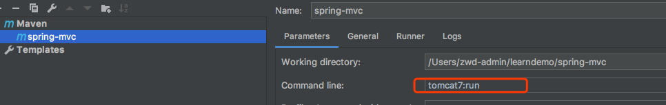

### 启动说明
本项目使用maven tomcat的插件进行启动，也可以打包放入tomcat中。

#### tomcat插件配置
```xml
<plugin>
    <groupId>org.apache.tomcat.maven</groupId>
    <artifactId>tomcat7-maven-plugin</artifactId>
    <version>2.1</version>
    <configuration>
        <!--<url>http://localhost:8080/data</url>-->
        <!--<server>tomcat7-local</server>-->
        <!--项目名称根路径-->
        <path>/spring-web</path>
    </configuration>

</plugin>
```
本人使用idea做为开发工具，这里展示idea配置过程。



启动成功即可访问。


### 基于servletContainerInitalizer替换web.xml必须要在lib下有个jar引导。
#### 制作jar包

创建一个META-INF文件夹，在META-INF文件夹下创建services文件夹，再创建文件，必须命名为javax.servlet.ServletContainerInitializer
内容为ServletContainerInitializer的实现类的全路径。

执行： jar cvf test.jar META-INF 进行打包。
打包后的jar包放在WEB-INF下的lib文件夹下。